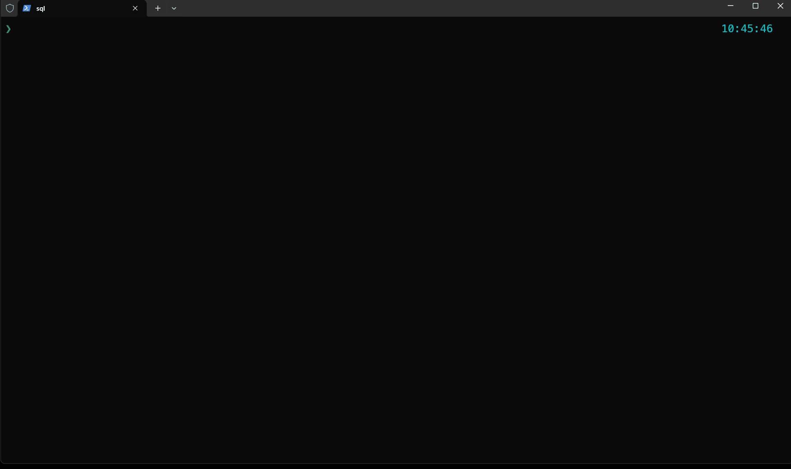
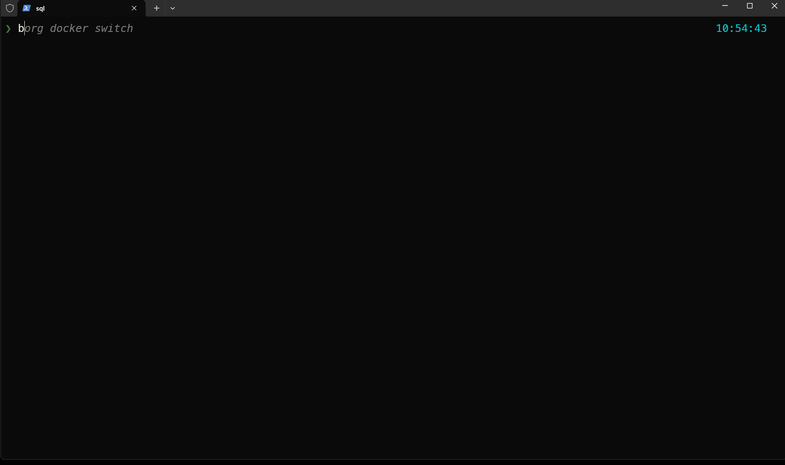

#   BORG — Backup Orchestrator for Reliable Groundwork 

BORG is a modular automation shell designed to manage SQL Server Docker containers and automate backup/restore workflows.

---

##   Features

-   Restore a `.bak` file using either its default name or a proposed alias
-   Docker SQL Server orchestration with automatic upload & provisioning
-   Handles `sqlcmd` ODBC TLS issues (ODBC Driver 18+ safe)
- 🧩 Modular architecture: scripts organized into `central`, `docker`, `database`
- 💬 Clean terminal UI with emoji-enhanced logging

---

##   Project Structure

```
borg/
├── config/               # Shared functions and configuration
├── data/                 # Data store (e.g. for values, presets)
├── logs/                 # Optional runtime logs
├── scripts/              # Main execution logic
│   └── win/
│       ├── central/      # Main entry points / menu scripts
│       ├── docker/       # Docker SQL helper logic
│       └── database/     # Placeholder for future DB tooling
├── resources/            # Optional assets
├── temp/                 # Temporary working folder
└── README.md             # You're reading this
```

---

##   Required & Optional Tools for Borg

####   Mandatory Tools
These are essential for Borg commands to work as intended:

| Tool    | Purpose                          | Install Command                    |
|---------|----------------------------------|------------------------------------|
| `fzf`   | Fuzzy finder for selections      | `winget install fzf`               |
| `micro` | Terminal-based text editor       | `winget install zyedidia.micro`    |

---

#### 🧩 Optional Tools
These tools enable specific Borg commands. If missing, affected features will be unavailable, but Borg remains functional.

| Tool        | Purpose                            | Install Command / Source                                          |
|-------------|------------------------------------|-------------------------------------------------------------------|
| `rclone`    | Google Drive integration            | Manual install from [rclone.org](https://rclone.org/downloads)   |
| `sqlpackage`| Export `.bacpac` SQL snapshots      | `choco install sqlpackage` or install from [Microsoft Docs](https://learn.microsoft.com/sql/tools/sqlpackage/sqlpackage-download) |
| `rclone`    | Google Drive integration            | Manual install from [rclone.org](https://rclone.org/downloads)   |
| `less`       | Terminal pager (keyboard navigation)| Comes with Git for Windows (`usr/bin/less.exe`) or install via `choco install less` |

---

## 🧪 Getting Started

> PowerShell 7.5.1 and Docker Desktop are required.

---

## 🎥 Live Demos

See BORG in action — each demo showcases a real workflow you can automate and streamline using BORG:

### 🛠️ Restore a SQL Snapshot in Seconds
[](docs/gifs/borg-docker-restore.gif)

### 🧷 Create Snapshots During Work to Capture Key States
[](docs/gifs/borg-docker-snapshot.gif)

### 🔁 Instantly Switch Between Snapshots Within the Same Session
[](docs/gifs/borg-docker-switch.gif)

---


### Install via Git Clone
```bash
git clone https://github.com/your-org/borg.git
```

### Install via PowerShell Gallery (if published)
```powershell
Install-Module Borg -Scope CurrentUser
```

### Inject into your PowerShell profile
```powershell
# >>> BORG INITIALIZATION START <<<
Import-Module Borg
# Optionally create a shortcut alias
Set-Alias b borg
# <<< BORG INITIALIZATION END >>>
```

### 🔧 Initialize Configuration

When you run any `borg` command (including `borg --version`) for the first time, BORG will automatically initialize your personal configuration by copying `store.example.json` into your user profile folder:

```
%APPDATA%\borg\store.json
```

This file stores your custom settings, such as SQL container names, backup paths, credentials, and more.

To edit your configuration, run:

```powershell
borg store
```

This will open your `store.json` in your preferred editor (e.g. Micro, Notepad, or VS Code depending on how you've configured `borg store` internally).

Alternatively, you can manually edit:

```
%APPDATA%\borg\store.json
```

Any changes you make here will be picked up immediately by all BORG commands.


Example configuration:
```json
{  
  "Docker": {
    "SqlContainer": "sqlserver-2022",
    "SqlInstance": "localhost,2022",
    "SqlImageTag": "mcr.microsoft.com/mssql/server:2022-latest",
    "SqlPort": 1433,
    "SqlUser": "sa",
    "SqlPassword": "yourStrong(!)Password"
  },
  "Bookmarks": [
    { "alias": "dtemp", "path": "D:\\temp" },
    { "alias": "kit",   "path": "C:\\Users\\youruser\\kits" }
  ]
}
```

## Known Issues
Error: Profile cannot be loaded because running scripts is disabled on this system.
Solution:
```powershell
Set-ExecutionPolicy -Scope CurrentUser -ExecutionPolicy RemoteSigned -Force
```
---

## 🧾 Common Commands

| Command                      | Alias(es)                | Description                                        |
|-----------------------------|---------------------------|----------------------------------------------------|
| `borg doctor`                | N/A                      | Checks system environment for required tools, PowerShell version, and config health            |
| `borg store`                | N/A                       | Opens your `store.json` config in Micro            |
| `borg bookmark`             | `b`                       | Jump to bookmark defined in the store.json under the `Bookmarks` chapter via interactive fzf selection.              |
| `borg jump store`           | N/A                       | Bookmark current folder with an alias              |
| `borg jump <alias>`         | `bj <alias>`              | Jump to a previously stored folder                 |
| `borg run`                  | N/A                       | Browse and execute a script from the custom scripts folder using fzf |
| `borg docker restore`       | `bdr`, `borg d r`         | Restore a `.bak` file into Docker SQL              |
| `borg docker snapshot <v>`  | `bds`, `borg d s`         | Create a snapshot from an active container         |
| `borg docker clean`         | `bdc`, `borg d c`         | Remove the SQL container and its volumes           |
| `borg docker switch`        | `bdsw`, `borg d sw`       | Restore one of the saved snapshots                 |
| `borg docker download`      | `bdd`, `borg d d`         | Download a snapshot from container to host         |
| `borg docker upload`        | `bdu`, `borg d u`         | Upload a backup file from host to container        |
| `borg docker query`         | `bdq`, `borg d q`         | Run SQL queries against a selected database        |
| `borg gdrive upload`        | N/A                       | fzf at current location you can choose a file to upload |
| `borg network kill`         | N/A                       | Kill processes by port (e.g., 80) or name (e.g., firefox), with optional interactive confirmation (`-c`) |
| `borg update`               | N/A                       | Update the BORG module from PowerShell Gallery     |
| `borg network bacpac`       | N/A                       | Export a `.bacpac` snapshot from any SQL Server defined in `store.json → SqlServers`, saved to `SqlBackupDefault` folder|
| `borg jira today`           | N/A                       | Shows your Jira worklogs for today, grouped by issue |
| `borg jira week`            | N/A                       | Shows your Jira worklogs for the current week        |
| `borg jira latest`          | [days]                    | Shows recently updated issues that mention or are assigned to you (default: 7 days) |
| `borg io folder-clean`      | `fc`                      | Clean predefined folders: wipe contents of all folders listed in `store.json → CleanFolders`|
| `borg sys shutdown`         | `ssd`                     | Gracefully shuts down the current station; useful for mobile-triggered shutdowns |
| `borg sys restart`          | `sr`                     | Gracefully restarts the current station; useful for mobile-triggered restarts |
| `borg clean versions`       | N/A                       |  Cleans up older BORG versions, keeping only the latest |
| `borg --version`            | N/A                       | Show installed and latest version                  |
 

---

##   How It Works

BORG is a modular CLI automation toolkit. It works by chaining interactive PowerShell scripts and terminal tools to manage and orchestrate tasks like:

- ⛴️ Starting and managing SQL Server containers
-   Uploading and restoring `.bak` and `.bacpac` files
-   Extracting or comparing database schemas
- 🔁 Syncing files with Google Drive via `rclone`
- 🗂️ Browsing and exporting Jira worklogs or issues
-   Backing up local SQL Server instances

Each command guides you interactively, uses fuzzy navigation (via `fzf`), and integrates with tools like `sqlpackage`, `rclone`, and `less` when available.


---

## 📱 Mobile Companion App

A mobile app is currently in development to make BORG even more accessible when you're away from your workstation.

It focuses on quick, practical interactions — such as:

- Checking the status of your stations
- Running key commands with a few taps
- Shutting down a station remotely

Designed to be lightweight and efficient, the app brings core BORG workflows into your pocket without overwhelming you with options.

---

## 🔒 Compatibility

-   SQL Server 2022
-   PowerShell 7.5.1+ (Windows Powershell is not supported)
-   Docker (Windows, Linux)
-   ODBC Driver 18+ (TLS-safe)

---

## ☁️ Google Drive Integration (via rclone)

To enable file uploads to Google Drive, BORG relies on [rclone](https://rclone.org), a powerful CLI tool for managing cloud storage.

##   Jira Integration

BORG provides two built-in commands to view your worklog activity in Jira:

- `borg jira today`: Shows today's worklogs grouped by issue
- `borg jira week`: Displays the worklogs for the current week

To use these, you'll need to:

1. Create a [Jira API token](https://id.atlassian.com/manage-profile/security/api-tokens)
2. Store the following information in your `store.json`:

```json
"Jira": {
  "Domain": "https://yourcompany.atlassian.net",
  "Email": "your.email@company.com",
  "APIToken": "your-api-token"
}
```

### Setup Steps

1. Download `rclone.exe` from [rclone.org/downloads](https://rclone.org/downloads) and place it in a known location (e.g. `C:\utility-scripts\rclone.exe`).

2. Follow the [rclone Google Drive setup guide](https://rclone.org/drive/) to create a remote configuration and generate your `rclone.conf`.

3. In your `store.json`, specify:
   - The full path to `rclone.exe`
   - The remote name and optional working path (e.g. subfolder)

Example `store.json` snippet:
```json
"Rclone": {
  "ExecutablePath": "C:\\utility-scripts\\rclone.exe",
  "RemoteName": "gdrive",
  "RemotePath": "borg-backups"
}
```

Make sure your `rclone.conf` includes the credentials for the `gdrive` remote, and that you’ve granted it access to the intended Google Drive folder.

Once configured, use:

```powershell
borg gdrive upload
```

to upload files interactively using `fzf` from the current directory.

## 🧹 Uninstalling BORG

If you want to remove the BORG module:

```powershell
Uninstall-Module Borg -AllVersions -Force
```

To remove it manually:

```powershell
Remove-Item "$env:USERPROFILE\Documents\PowerShell\Modules\Borg" -Recurse -Force
```

To clean it from your profile:

```powershell
(Get-Content $PROFILE) | Where-Object { $_ -notmatch 'Import-Module Borg' } | Set-Content $PROFILE
```

---

##   Roadmap

- [x] Restore any `.bak` file
- [x] Add backup/snapshot support
- [x] Jump to bookmark defined in the store.json under the 'Bookmarks' chapter via interactive fzf selection.
- [x] Jump between stored aliases folders
- [x] Clean docker
- [x] Jump between snapshots inside the container
- [x] Download to host from container
- [x] Upload snapshots to the container's backup folder
- [x] Execute ad-hoc SQL queries directly against the containerized database
- [x] Add shorthand aliases (e.g., `br`, `bdr`, `borg d r`) for faster command access
- [x] Add `borg help` to show available modules and commands
- [x] Open bash shell in the container's backup folder
- [x] Restore database from snapshots already in container
- [x] Add version command and info into borg help
- [x] Add borg update command - for ease of use
- [x] Upload chosen file to gdrive
- [x] Fallback to predefined SQL backup folder when no valid backups are found in the current directory
- [x] Ensure clean restore: On borg docker switch, automatically terminate any existing connections to the target database to prevent restore failures.
- [x] Run user custom scripts
- [x] Choice to remove automatically older versions of BORG;
- [x] Borg doctor (will check for mandatory and optional third-party tools required for operation)
- [x] Restore from bacpac
- [x] Kill process by port or name, optionally prompting for confirmation
- [x] Obtain a .bacpac snapshot from a database selected via connection strings defined in `store.json → SqlServers`.
- [x] Jira workflow spent time today
- [x] Jira workflow spent time week
- [x] Jira workflow spent time latest
- [x] Clean predefined folders: wipe contents of all folders listed in `store.json → CleanFolders` with a single command.
- [x] Shutdown of the stations, especially to be used from mobile app
- [x] Restart of the stations, especially to be used from mobile app
- [ ] Add `install.ps1` to configure execution policy and profile on first run
---

## 🖧 SSH Setup for Borg on Windows Stations

To ensure remote SSH sessions land in **PowerShell 7+** and automatically load the Borg module, follow these steps on each station:

### ✅ 1. Install Borg system-wide
Run from an **elevated PowerShell 7+ terminal**:
```powershell
Install-Module Borg -Scope AllUsers -Force
```

---

### ✅ 2. Add PowerShell 7 to the system PATH (if not already)
```powershell
[Environment]::SetEnvironmentVariable("Path", "$env:Path;C:\Program Files\PowerShell", "Machine")
```

> 📌 This ensures `pwsh` is discoverable in all contexts, including system services like `sshd`.

---

### ✅ 3. Set PowerShell 7 as the default shell for SSH
```powershell
New-ItemProperty -Path "HKLM:\SOFTWARE\OpenSSH" `
  -Name DefaultShell `
  -Value "C:\Program Files\PowerShell\7\pwsh.exe" `
  -PropertyType String -Force
```

Then apply the change:
```powershell
Restart-Service sshd
```

---

### ✅ 4. Verify SSH opens `pwsh`
From a remote machine:
```bash
ssh yourUser@stationName
```

Then confirm:
```powershell
$PSVersionTable.PSVersion
```

You should see PowerShell 7.x.

---

### ✅ 5. Add Borg auto-import to PowerShell profile

Run inside the `pwsh` session to determine the correct profile path:
```powershell
$PROFILE
```

Then open the file locally or remotely and append:
```powershell
# >>> BORG INITIALIZATION START <<<
Import-Module Borg
# Optionally create a shortcut alias
Set-Alias b borg
# <<< BORG INITIALIZATION END <<<
```

> 💡 Use `$PROFILE.AllUsersCurrentHost` to apply it for all users on the station.

---

Once complete, any SSH session will:
- Start in PowerShell 7+
- Load the Borg module
- Enable quick access via `borg` or `b` commands


##   License

MIT — see `LICENSE` for details.